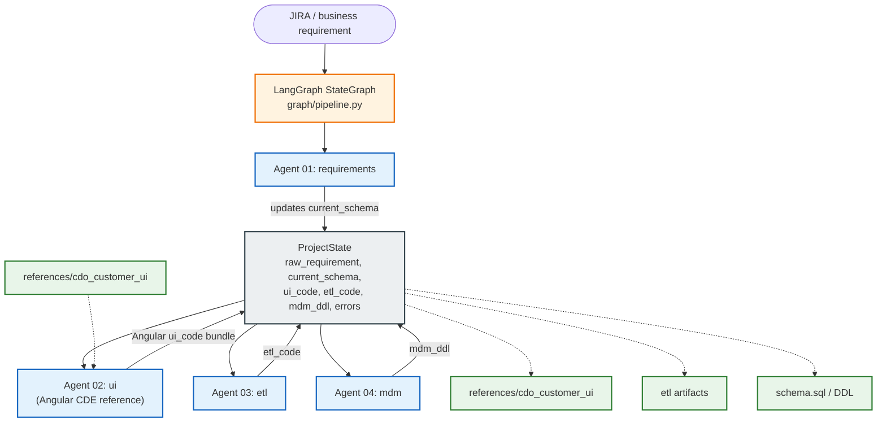

# System Architecture & Flowchart

> LangGraph orchestrates Agents 01→02→03→04. Agent 02 uses the Angular CDE UI reference.

```mermaid
flowchart TD
    %% Styling
    classDef stateNode fill:#eceff1,stroke:#37474f,stroke-width:2px;
    classDef agentNode fill:#e3f2fd,stroke:#1565c0,stroke-width:2px;
    classDef outputNode fill:#e8f5e9,stroke:#2e7d32,stroke-width:2px;
    classDef graphNode fill:#fff3e0,stroke:#ef6c00,stroke-width:2px;

    Graph["LangGraph StateGraph<br/>graph/pipeline.py"]:::graphNode

    %% Memory State
    State["ProjectState<br/>raw_requirement, current_schema,<br/>ui_code, etl_code, mdm_ddl, errors"]:::stateNode

    %% Agent Flow
    A1["Agent 01: requirements"]:::agentNode
    A2["Agent 02: ui<br/>(Angular CDE reference)"]:::agentNode
    A3["Agent 03: etl"]:::agentNode
    A4["Agent 04: mdm"]:::agentNode

    %% Execution Graph
    Start([JIRA / business requirement]) --> Graph
    Graph --> A1
    A1 -->|updates current_schema| State
    State --> A2
    Ref["references/cdo_customer_ui"]:::outputNode -.-> A2
    A2 -->|Angular ui_code bundle| State
    State --> A3
    A3 -->|etl_code| State
    State --> A4
    A4 -->|mdm_ddl| State

    %% File Artifacts
    State -.-> AppPy["references/cdo_customer_ui"]:::outputNode
    State -.-> EtlPy["etl artifacts"]:::outputNode
    State -.-> SchemaSql["schema.sql / DDL"]:::outputNode
```
