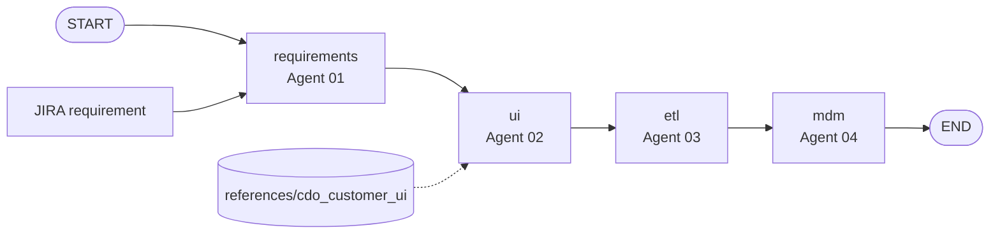

# LangGraph MDM pipeline

## Graph



## State

`ProjectState` (Pydantic) is the LangGraph state:

- `raw_requirement` — JIRA / business text
- `current_schema` — EntitySchema from Agent 01
- `ui_code` — Agent 02 Angular file bundle for Customer Data Essentials
- `etl_code` — Agent 03 transform script
- `mdm_ddl` — Agent 04 SQL DDL
- `errors` — accumulated errors

## Entry points

| Entry | Purpose |
|-------|---------|
| `graph.pipeline.build_mdm_pipeline()` | Compile `StateGraph` |
| `graph.pipeline.run_mdm_pipeline(text)` | Invoke full graph |
| `python run_pipeline.py "..."` | CLI runner |
| `python run_pipeline.py "..." --apply-ui` | Also write UI files into the Angular reference |

## Agent 02 UI behavior

The `ui` node loads curated files from `references/cdo_customer_ui` and asks the LLM to emit:

```text
### FILE: references/cdo_customer_ui/<path>
<full file contents>
```

Use `agents.ui_reference_loader.apply_ui_bundle(state.ui_code)` (or `--apply-ui`) to write those updates onto disk.
