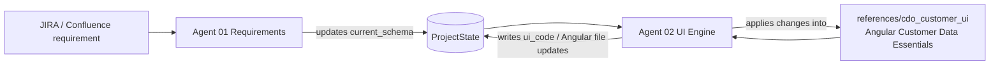

# Agent 02 — UI reference wiring

## Behavior

1. Agent 01 evolves `EntitySchema` from the business requirement.
2. Agent 02 loads the Angular baseline under `references/cdo_customer_ui`.
3. Agent 02 proposes Angular Material UI changes that implement the new fields
   while preserving CDE search UX (Legal/Primary address tabs, phone/email columns, etc.).
4. Generated output is stored on `ProjectState.ui_code` for review / apply.
